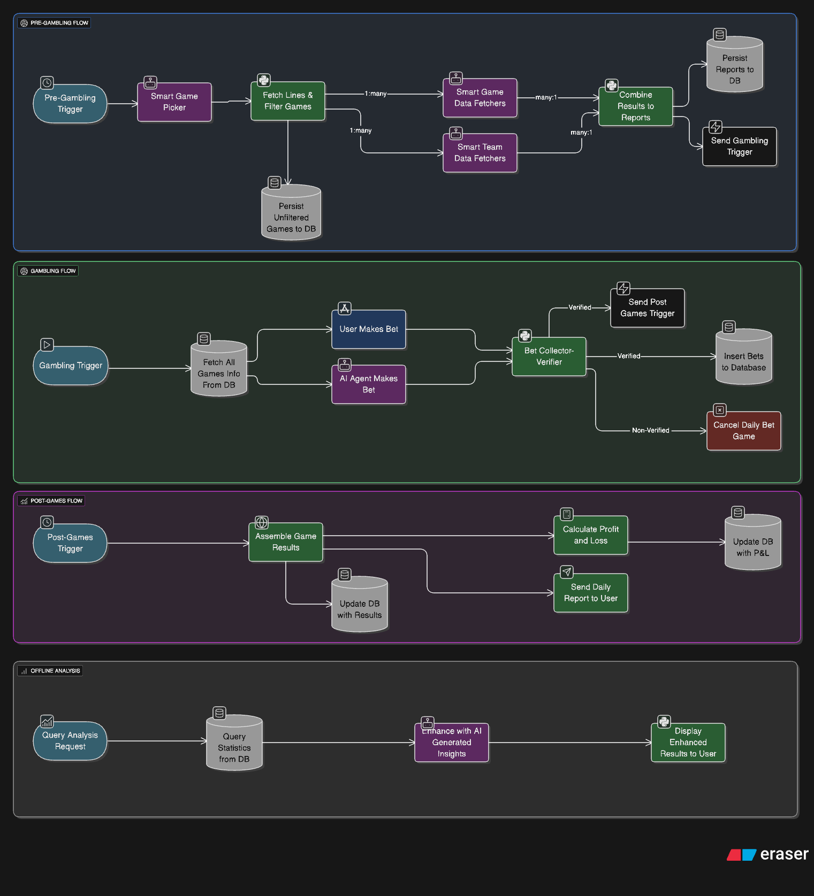

# Smart AI Soccer Betting System

A **non-monetary, AI-assisted daily soccer game betting system** where both AI and user compete by placing simulated bets on selected daily matches. Powered by rich real-time data, structured analysis, and LangGraph orchestration.

---

## System Architecture

The system is organized around **four main application flows**, each responsible for a distinct stage of the daily soccer-betting lifecycle:

### Daily Execution Flow

| Flow | Trigger | Purpose |
|------|---------|---------|
| **Pre-Gambling** | Daily cron schedule | Select games, fetch data, build reports |
| **Gambling** | After Pre-Gambling completes | Collect bets from user and AI |
| **Post-Games** | Scheduled dynamically (e.g., 3h after latest kickoff) | Fetch results, compute P&L |
| **Offline Analysis** | On-demand | Generate statistics and insights |

---

## Technology Stack

| Component | Technology |
|-----------|------------|
| **Runtime** | Python 3.13 |
| **Graph Engine** | LangGraph + LangGraphWrappers |
| **Database** | PostgreSQL / MySQL (relational) |
| **Frontend** | TBD (Telegram bot or app) |
| **Data Sources** | APIs (preferred) with scraper fallback |
| **Parallelism** | LangGraph subgraphs for game/team-level concurrency |

---

## Core Concepts

### Betting Model

- **3 outcomes per game**: `'1'` (home win), `'x'` (draw), `'2'` (away win)
- **3 betting lines**: `n1`, `n2`, `n3` (float odds)
- **Single bets only** (no combinations)
- **100 NIS simulated stake** per game for both user and AI
- **P&L calculation**: Win = stake × odds | Loss = −stake

### Game Selection

Games are selected based on configurable thresholds that ensure meaningful betting opportunities with substantial potential gains.

---

## Application Flows

### 1. Pre-Gambling Flow

Runs daily to prepare the betting environment:

1. **Game Selection** — Picks matches, fetches betting lines, filters interesting games
2. **Parallel Data Fetching** — Runs game and team subgraphs concurrently
3. **Report Generation** — Combines data and persists reports to DB
4. **Flow Trigger** — Initiates Gambling Flow

### 2. Gambling Flow

Manages the betting process:

1. **Load Reports** — Fetches today's games and reports from DB
2. **User Bet** — Collects bet via UI/Bot
3. **AI Bet** — AI agent places its bet using ModelWrapper
4. **Validation** — Verifies both bets arrived before deadline
5. **Persistence** — Saves bets or cancels the day's run
6. **Scheduling** — Sets trigger time for Post-Games Flow

### 3. Post-Games Flow

Settles the day's bets:

1. **Fetch Results** — Retrieves final scores online
2. **Compute P&L** — Calculates profit/loss for user and AI
3. **Update DB** — Persists results
4. **Notify User** — Sends daily summary

### 4. Offline Analysis Flow

On-demand analytics:

- Query success rates and P&L breakdowns
- Team and league statistics
- AI-generated insights and explanations

---

## Data Collection

### Implemented Tools

**8 tools** currently implemented across 4 data sources:

| Tool | Type | Data | Source |
|------|------|------|--------|
| `fetch_h2h` | Game | Head-to-head history | football-data.org |
| `fetch_venue` | Game | Stadium name, city, capacity | FotMob API |
| `fetch_weather` | Game | Match-day forecast | FotMob + Open-Meteo |
| `fetch_odds` | Game | Betting lines (1/X/2) | The Odds API |
| `fetch_form` | Team | Recent W/D/L (last 5 games) | FotMob API |
| `fetch_injuries` | Team | Unavailable players list | FotMob API |
| `fetch_league_position` | Team | Full league standings | FotMob API |
| `calculate_recovery_time` | Team | Days since last match | FotMob API |

**Tool Interfaces:**
- **Game tools** (4): Accept `(home_team, away_team)` — called once per match
- **Team tools** (4): Accept `(team_name)` — called twice per match (home + away)
- **Total calls per match:** 12

### Data Sources

| Source | API Key | Rate Limit | Used For |
|--------|---------|------------|----------|
| FotMob (mobfot) | None | Unlimited | Form, Venue, Injuries, Standings, Recovery |
| football-data.org | Required | 10 req/min | H2H only |
| The Odds API | Required | 500 credits/mo | Betting lines |
| Open-Meteo | None | 10k req/day | Weather forecasts |

### Not Yet Implemented

| Data Point | Reason |
|------------|--------|
| Team News | Requires scraping (no free API) |
| Suspensions | API returns empty data |
| Player Stats/Form | No free API available |
| Morale/Coach News | No structured API |
| Rotation Policy | Too unreliable |

> **Design principle**: Subflows are modular and extendible. New fetchers can be added as nodes to game/team subflows.

---

## References

This project follows patterns from:

- **[LangGraphWrappers](https://github.com/Omer-Pinto/LangGraphWrappers)** — Wrapper layer for graphs, nodes, models, tools, and MCP integration
- **[StocksMarketRecommender](https://github.com/Omer-Pinto/StocksMarketRecommender)** — Reference architecture for graph managers, state management, routers, and subgraph orchestration

---

## License

TBD

---

  <i>Built with LangGraph and AI-powered analysis</i>

