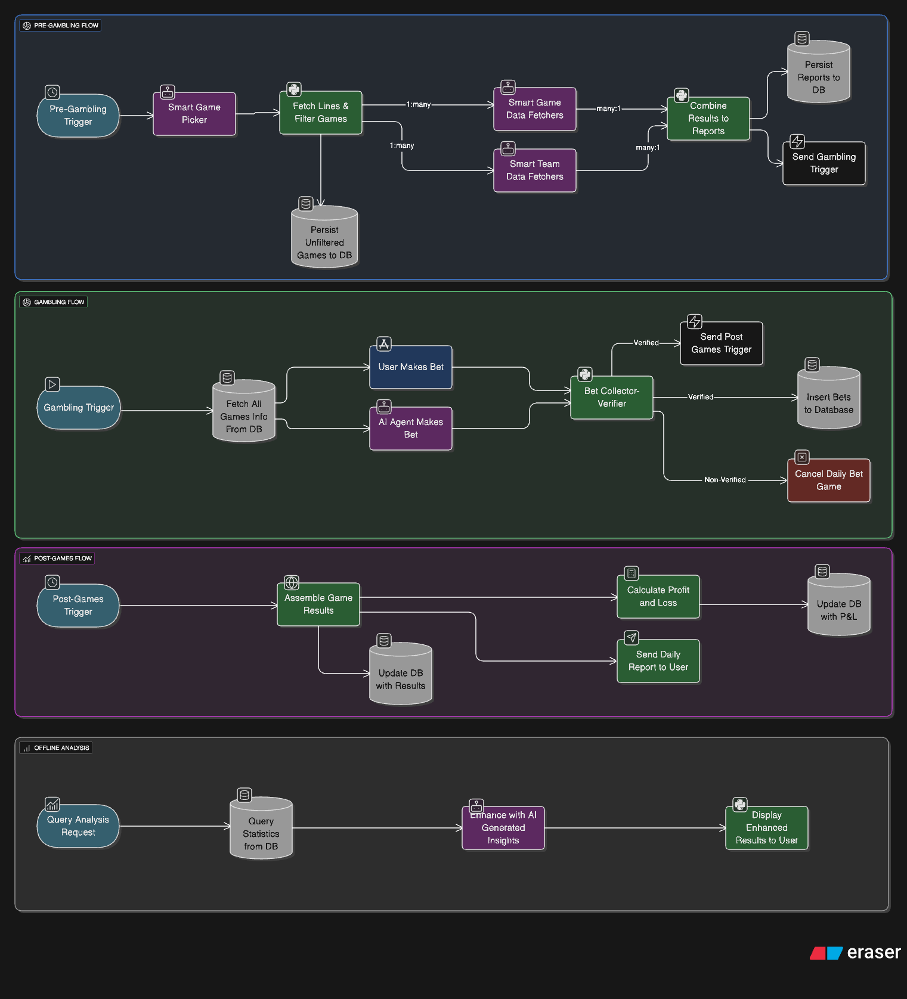
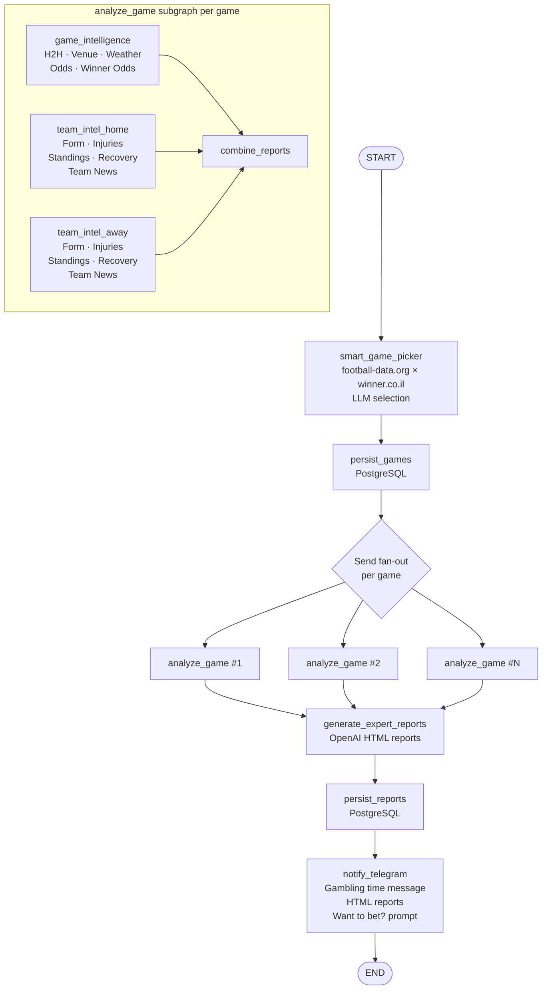
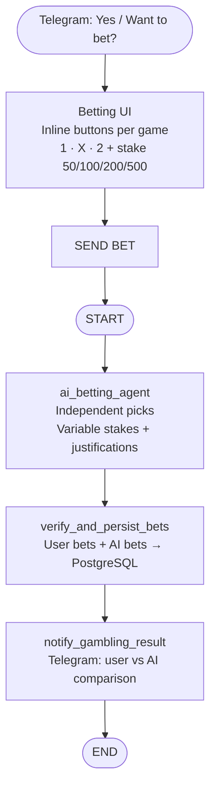
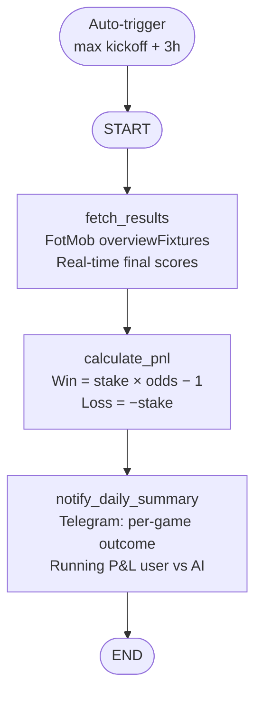
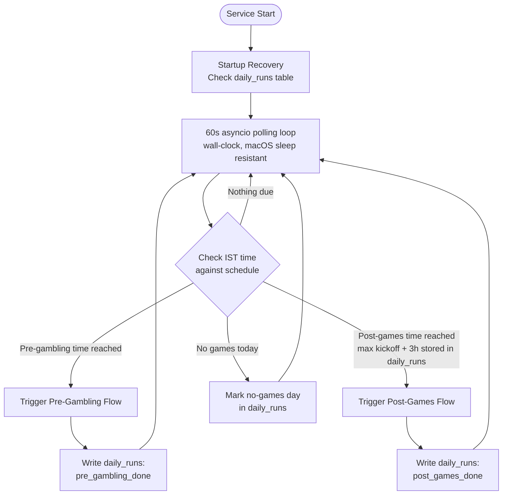

# Smart AI Soccer Betting System

A **non-monetary, AI-assisted daily soccer game betting system** where both AI and user compete by placing simulated bets on selected daily matches. Powered by rich real-time data, structured analysis, and LangGraph orchestration.

---

## System Architecture

The system is organized around **four main application flows**, each responsible for a distinct stage of the daily soccer-betting lifecycle:

### Daily Execution Flow

| Flow | Trigger | Purpose |
|------|---------|---------|
| **Pre-Gambling** | Daily wall-clock schedule (IST) | Select games, fetch data, build reports |
| **Gambling** | After Pre-Gambling completes | Collect bets from user and AI via Telegram |
| **Post-Games** | Auto-triggered: max(kickoff) + 3h | Fetch results, compute P&L |
| **Offline Analysis** | On-demand | Generate statistics and insights |

---

## Technology Stack

| Component | Technology |
|-----------|------------|
| **Runtime** | Python 3.13 |
| **Graph Engine** | LangGraph 1.x (Send() API for parallelism) |
| **Database** | PostgreSQL 16 (Docker, port 5433, TZ=Asia/Jerusalem) |
| **Frontend** | Telegram Bot (python-telegram-bot) |
| **AI Models** | OpenAI gpt-5.4 / gpt-5.4-mini |
| **Data Sources** | FotMob (custom signed client), football-data.org, winner.co.il, The Odds API, Open-Meteo |
| **Scheduling** | Wall-clock polling (60s asyncio loop, macOS sleep resistant) |

---

## Core Concepts

### Betting Model

- **3 outcomes per game**: `'1'` (home win), `'X'` (draw), `'2'` (away win)
- **Single bets only** (no combinations)
- **Variable stakes**: 50, 100, 200, or 500 NIS per game (chosen per bet)
- **Starting bankroll**: 10,000 NIS each (user and AI)
- **P&L calculation**: Win = stake × (odds − 1) | Loss = −stake (Israeli Toto format)

### Game Selection

Games are selected by cross-referencing football-data.org fixtures against winner.co.il odds, filtered via LLM-assisted selection to ensure meaningful betting opportunities.

---

## Application Flows

### 1. Pre-Gambling Flow

Runs daily to prepare the betting environment:

1. **Game Selection** (`smart_game_picker`) — cross-refs football-data.org fixtures × winner.co.il odds, LLM filters for interesting games
2. **Persist Games** — saves selected games to DB
3. **Parallel Data Fetching** — Send() fan-out: each game runs an `analyze_game` subgraph with three parallel branches (game intelligence, home team intel, away team intel)
4. **Report Generation** — combines branch results, LLM generates expert HTML reports
5. **Persist Reports** — saves reports to DB
6. **Telegram Notification** — sends gambling time message, HTML reports, and "Want to bet?" prompt

### 2. Gambling Flow

Manages the betting process:

1. **Load Reports** — fetches today's games and reports from DB
2. **User Bet** — Telegram inline buttons: 1/X/2 per game + variable stake selection; user submits via SEND BET
3. **AI Bet** — AI agent places independent bets with variable stakes and written justifications
4. **Validation & Persistence** — verifies and persists both bets; cancels day if deadline missed
5. **Summary** — comparison message sent to Telegram showing user vs. AI selections

### 3. Post-Games Flow

Settles the day's bets:

1. **Fetch Results** — FotMob `overviewFixtures` for real-time final scores
2. **Compute P&L** — won = stake × (odds − 1), lost = −stake
3. **Update DB** — persists results
4. **Daily Summary** — Telegram message with outcome per game and running P&L for user and AI

### 4. Offline Analysis Flow

On-demand analytics:

- Query success rates and P&L breakdowns
- Team and league statistics
- AI-generated insights and explanations

---

## Current System State

Mermaid diagrams reflecting the live implementation.

### Pre-Gambling Flow

```mermaid
flowchart TD
    START([START]) --> SGP[smart_game_picker\nfootball-data.org × winner.co.il\nLLM selection]
    SGP --> PG[persist_games\nPostgreSQL]
    PG --> FANOUT{Send fan-out\nper game}

    FANOUT --> AG1[analyze_game #1]
    FANOUT --> AG2[analyze_game #2]
    FANOUT --> AGN[analyze_game #N]

    subgraph analyze_game [analyze_game subgraph per game]
        GI[game_intelligence\nH2H · Venue · Weather\nOdds · Winner Odds]
        TH[team_intel_home\nForm · Injuries\nStandings · Recovery\nTeam News]
        TA[team_intel_away\nForm · Injuries\nStandings · Recovery\nTeam News]
        CR[combine_reports]
        GI --> CR
        TH --> CR
        TA --> CR
    end

    AG1 & AG2 & AGN --> GER[generate_expert_reports\nOpenAI HTML reports]
    GER --> PR[persist_reports\nPostgreSQL]
    PR --> NT[notify_telegram\nGambling time message\nHTML reports\nWant to bet? prompt]
    NT --> END([END])
```

### Gambling Flow

```mermaid
flowchart TD
    TG([Telegram: Yes / Want to bet?]) --> UI[Betting UI\nInline buttons per game\n1 · X · 2 + stake 50/100/200/500]
    UI --> SB[SEND BET]
    SB --> START([START])
    START --> ABA[ai_betting_agent\nIndependent picks\nVariable stakes + justifications]
    ABA --> VPB[verify_and_persist_bets\nUser bets + AI bets → PostgreSQL]
    VPB --> NGR[notify_gambling_result\nTelegram: user vs AI comparison]
    NGR --> END([END])
```

### Post-Games Flow

```mermaid
flowchart TD
    TRIGGER([Auto-trigger\nmax kickoff + 3h]) --> START([START])
    START --> FR[fetch_results\nFotMob overviewFixtures\nReal-time final scores]
    FR --> CP[calculate_pnl\nWin = stake × odds − 1\nLoss = −stake]
    CP --> NDS[notify_daily_summary\nTelegram: per-game outcome\nRunning P&L user vs AI]
    NDS --> END([END])
```

### Daily Automation (Wall-Clock Scheduler)

```mermaid
flowchart TD
    BOOT([Service Start]) --> REC[Startup Recovery\nCheck daily_runs table]
    REC --> POLL[60s asyncio polling loop\nwall-clock, macOS sleep resistant]
    POLL --> CHK{Check IST time\nagainst schedule}

    CHK -- Pre-gambling time reached --> PGF[Trigger Pre-Gambling Flow]
    CHK -- Post-games time reached\nmax kickoff + 3h stored in daily_runs --> POF[Trigger Post-Games Flow]
    CHK -- No games today --> SKIP[Mark no-games day\nin daily_runs]
    CHK -- Nothing due --> POLL

    PGF --> DR1[Write daily_runs:\npre_gambling_done]
    POF --> DR2[Write daily_runs:\npost_games_done]
    SKIP --> POLL
    DR1 --> POLL
    DR2 --> POLL
```

---

## Data Collection

### Implemented Tools

**11 tools** currently implemented across 5 data sources:

| Tool | Type | Source |
|------|------|--------|
| `fetch_daily_fixtures` | Game | football-data.org |
| `fetch_h2h` | Game | football-data.org |
| `fetch_venue` | Game | FotMob |
| `fetch_weather` | Game | FotMob + Open-Meteo |
| `fetch_odds` | Game | The Odds API |
| `fetch_winner_odds` | Game | winner.co.il |
| `fetch_form` | Team | FotMob |
| `fetch_injuries` | Team | FotMob |
| `fetch_league_position` | Team | FotMob |
| `calculate_recovery_time` | Team | FotMob |
| `fetch_team_news` | Team | FotMob |

**Tool Interfaces:**
- **Game tools** (6): Accept `(home_team, away_team)` — called once per match
- **Team tools** (5): Accept `(team_name)` — called twice per match (home + away)

### Data Sources

| Source | API Key | Used For |
|--------|---------|----------|
| FotMob (custom signed client, x-mas header) | None | Form, Venue, Injuries, Standings, Recovery, Team News, Results |
| football-data.org | Required | Daily Fixtures, H2H |
| winner.co.il | None (session cookies) | Israeli Toto odds (1X2) |
| The Odds API | Required | International odds |
| Open-Meteo | None | Weather forecasts |

> **Design principle**: Subflows are modular and extendible. New fetchers can be added as nodes to game/team subflows.

---

## License

MIT
